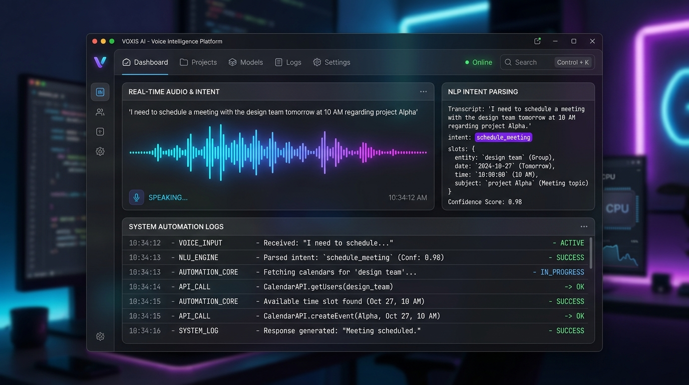
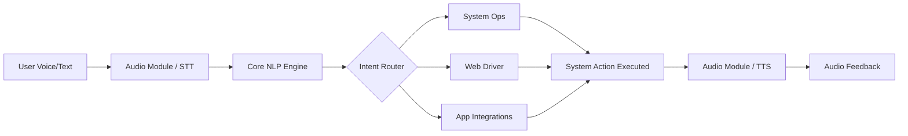

<div align="center">

# 🚀 AI VOICE ASSISTANCE AND AUTOMATIONS

### AI-Powered PC Automation & Voice Assistant

[](https://opensource.org/licenses/MIT)
[](https://www.python.org/)
[]()

**Aura is an advanced, locally-hosted AI voice assistant designed to automate complex PC tasks, navigate your system, and process natural language commands with minimal latency.**



</div>

---

## ✨ Features

* ⚡ **Real-time Processing** — Processes voice and text inputs with near-zero latency using optimized local audio pipelines.
* 🤖 **AI-Powered Intent Recognition** — Leverages advanced NLP to map vague human instructions into precise system actions.
* ⚙️ **Deep System Automation** — Seamlessly controls system hardware monitors, GUI elements, and web browsers via `pyautogui` and `psutil`.
* 🗣️ **Continuous Wake Word Detection** — Always-on, low-resource background listening for immediate activation.
* 🧩 **Modular Architecture** — Easily extensible audio, UI, and core engine modules.

---

## 🎯 Problem

Managing a desktop environment efficiently often requires a combination of endless clicking, typing, and navigating nested menus. For power users, developers, or individuals with accessibility needs, executing multi-step workflows (like setting up a coding environment, extracting data, or managing system resources) is repetitive and time-consuming. 

Existing voice assistants are typically locked down to web searches or basic smart home tasks. Aura brings the power of AI directly to your operating system, giving you complete, programmable control over your local machine through natural language.

---

## 💡 Solution

Aura solves this by acting as a bridge between human speech and raw system APIs. It listens for a wake word, transcribes your speech into text, uses an AI engine to determine the exact intent and parameters, and then triggers the appropriate system automation script.



---

## 🛠️ Tech Stack

| Technology | Purpose |
| :--- | :--- |
| **Python 3.10+** | Core programming language driving the logic and automation. |
| **OpenAI API** | Natural language processing, intent extraction, and conversational context. |
| **SpeechRecognition** | Handles microphone input and Speech-to-Text (STT) conversion. |
| **pyttsx3 / PyAudio** | Local, offline Text-to-Speech (TTS) engine and audio stream management. |
| **PyAutoGUI** | Programmatic control of the mouse and keyboard for UI automation. |
| **psutil** | Cross-platform system monitoring and process management. |

---

## 📂 Project Structure

```text
Voice-assist/
├── src/
│   ├── core/           # NLP processing, engine state, and context memory
│   ├── audio/          # STT, TTS, and wake word detection modules
│   ├── automation/     # Scripts for system operations, web navigation, and app logic
│   ├── ui/             # System tray icon and main graphical interface
│   ├── utils/          # Config parsers and system loggers
│   └── main.py         # Application entry point
├── tests/              # Unit and integration tests
├── docs/               # Advanced setup and API documentation
├── requirements.txt    # Python package dependencies
└── .env.example        # Template for API keys and environment variables
```

---

## ⚙️ Installation

### Prerequisites

* Python 3.10 or higher
* A working microphone and speakers
* PortAudio (required for PyAudio)
* An OpenAI API Key (if using the cloud NLP engine)

### Clone

```bash
git clone https://github.com/kamalesh404/Voice-assist.git
cd Voice-assist
```

### Install Dependencies

It is highly recommended to use a virtual environment.

```bash
python -m venv venv
source venv/bin/activate  # On Windows use: venv\Scripts\activate
pip install -r requirements.txt
```

### Environment Variables

Copy the example environment file and add your credentials.

```bash
cp .env.example .env
```

Inside your `.env` file, configure the following:

```env
OPENAI_API_KEY=your_openai_api_key_here
ELEVENLABS_API_KEY=your_elevenlabs_api_key_here
WAKE_WORD=aura
USE_LOCAL_LLM=False
```

---

## ▶️ Usage

To launch Aura in standard mode:

```bash
python src/main.py
```

Once running, simply say your configured wake word (default: "Aura") followed by your command. 

**Example Commands:**
* *"Aura, open a new browser window and navigate to GitHub."*
* *"Aura, what is my current CPU and RAM usage?"*
* *"Aura, close all running instances of Notepad."*

---

## 🧪 Testing

The repository includes a comprehensive test suite covering the audio pipeline, NLP processors, and automation scripts.

Run the test suite using `pytest`:

```bash
pytest tests/
```

---

## 🔐 Security

* **API Keys:** Never commit your `.env` file. It is already included in the `.gitignore`.
* **System Execution:** Aura has the ability to execute code and move your mouse. Be cautious when granting it administrative privileges.

---

## 🗺️ Roadmap

### ✅ Completed
* Core intent recognition engine
* Audio STT/TTS pipeline integration
* Basic UI automation and mouse control
* Process and hardware monitoring via psutil

### 🚧 In Progress
* Context-aware conversational memory bridging multiple commands
* Custom browser extension integration for web-specific DOM automation

### 🔮 Planned
* Support for local LLMs (Llama 3 / Mistral) to completely eliminate cloud dependencies
* Plugin architecture for community-built automation scripts

---

## 🤝 Contributing

1. Fork the Project
2. Create your Feature Branch (`git checkout -b feature/AmazingFeature`)
3. Commit your Changes (`git commit -m 'Add some AmazingFeature'`)
4. Push to the Branch (`git push origin feature/AmazingFeature`)
5. Open a Pull Request

---

## 📜 License

Distributed under the MIT License.

---

## ⭐ Support

If you find Aura useful, please consider giving it a star on GitHub! For bugs and feature requests, please open an issue in the repository. 
